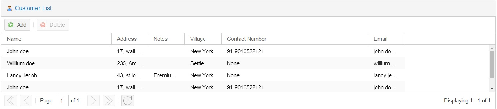

ext-auto-grid
=============
<h3>The jQuery plugin which will convert your HTML element to fully functional extjs REST grids backed by spring-data-rest</h3>
<h5>Plugin understands spring-data-rest responses well.</h5>

<h6>What we have?</h6>

```html
<html>
    <div id="extRestGrid"></div>
</html>
```

<h6>Step 1. Include required JS & CSS</h6>

```html
<!-- Adding ext all responsive touch css theme -->
<link rel="stylesheet" href="ext/css/ext-theme-crisp-touch-all.css">
<!-- Loading ext js core -->
<script src="ext/js/ext-all.js"></script>
<!-- take the jquery from google cdn -->
<script src="js/jquery.min.js"></script>
<!-- use my plugin -->
<script src="ext-auto-grid.js"></script>
```

<h6>Step 2. We know the spring-data-rest JSON response</h6>

```js
{
    "_links": {
        "self": {
            "href": "http://localhost:8080/customers?_dc=1408360943681&page=1&start=0&limit=20{&size,sort}"
        }
    },
    "_embedded": {
        "customers": [
            {
                "version": 1,
                "createdDate": 1408249469990,
                "updatedDate": 1408256672987,
                "name": "John doe",
                "village": "New York",
                "contactNumber": "91-9016522121",
                "email": "john.doe@gmail.com",
                "address": "17, wall street, NY",
                "notes": "",
                "image": null,
                "_links": {
                    "self": {
                        "href": "http://localhost:8080/customers/1"
                    }
                }
            }
        ]
    },
    "page": {
        "size": 20,
        "totalElements": 1,
        "totalPages": 1,
        "number": 0
    }
}
```

<h6>Step 3. Use this plugin to convert it to ext js REST grid.</h6>

```js
 $("#extRestGrid").extAutoGrid({
        url: 'server/static.json',
        title: 'Customer List',
        width: '100%',
        root: '_embedded.customers',
        fields: ['name', 'address', 'notes', 'village', 'contactNumber', 'email'],
        columns: [
            {text: 'Name',
                dataIndex: 'name',
                width: 300,
                field: {
                    xtype: 'textfield'
                }},
            {text: 'Address',
                dataIndex: 'address',
                field: {
                    xtype: 'textfield'
                }},
            {text: 'Notes',
                dataIndex: 'notes',
                field: {
                    xtype: 'textfield'
                }},
            {text: 'Village',
                dataIndex: 'village',
                field: {
                    xtype: 'textfield'
                }},
            {text: 'Contact Number',
                dataIndex: 'contactNumber',
                width: 400,
                field: {
                    xtype: 'textfield'
                }},
            {text: 'Email',
                dataIndex: 'email',
                field: {
                    xtype: 'textfield'
                }}
        ]
    });
```

<h6>The result</h6>
